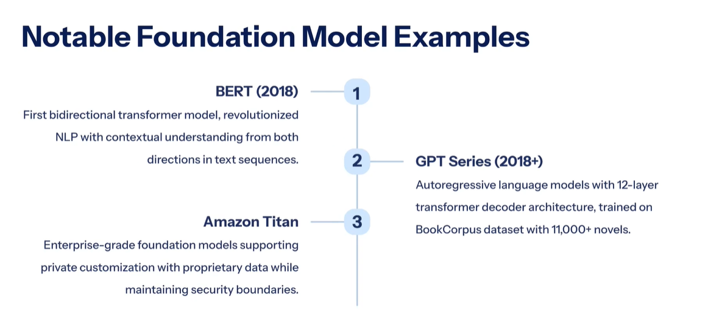
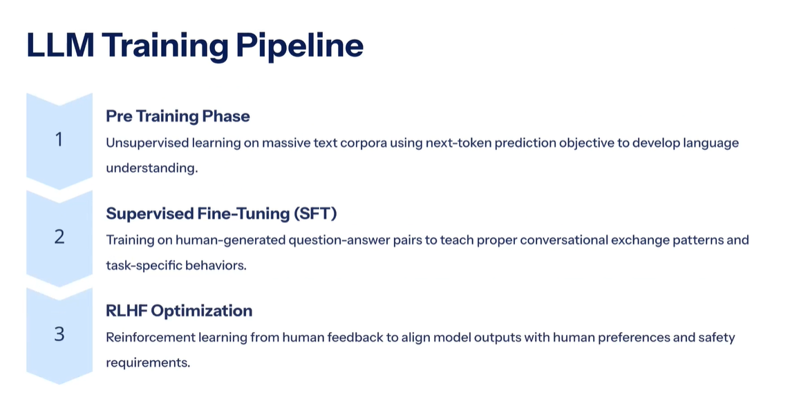
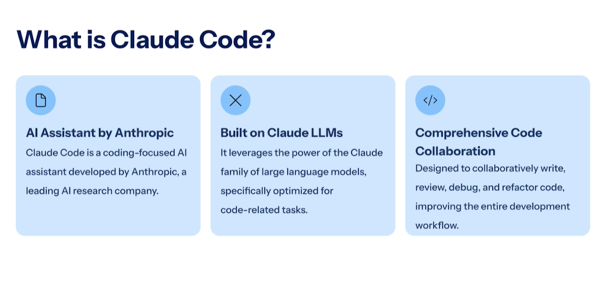
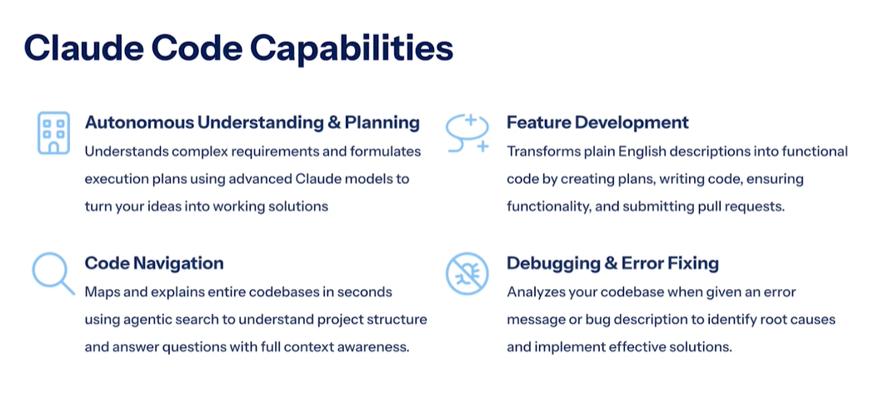
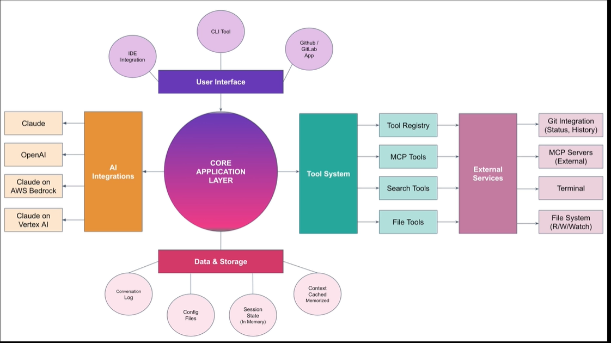
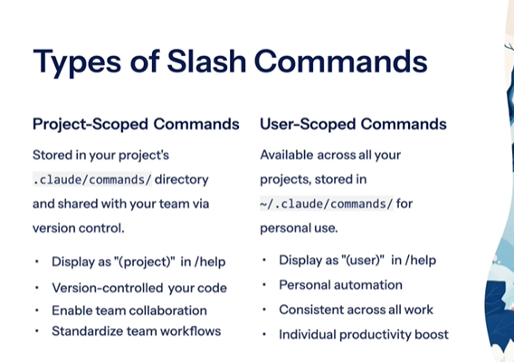

Machine Learning Model 

=> Foundational model 
=> Language Model 
=> Large Language Model 
=> MultiModal Model 

Foundational model 
------------------

Scale and arc :- Large deep learning neutral network trained based on  massive diverse datasets using transfermor 
arc with billions parameter 

Generalising Capabilites :- Trained on broad spectrum of unlabeled data , enabling wide varity of downstream tasks 
without the task specific training 

Language Model :-

What is claude Code ??

Claude Code arc 
---------------

Slash commands :- 
------------------

Built in commands 

/help :- List commands 

/add-dir :- Expand workspace 

/mcp :- Manages server 

/compact :- Compress chat 

/init :- Initialise project  

-------------------------------
Specific Metadata for commands 
------------------------------

1. allowed tools 
2. argument hint 
3. description 

4. model 
4. disable model 

check the example inn .claude/commands/expense-tracker.md

we will start from this :- https://www.udemy.com/course/claude-code-generative-ai-assisted-development/learn/lecture/53202229#notes  

